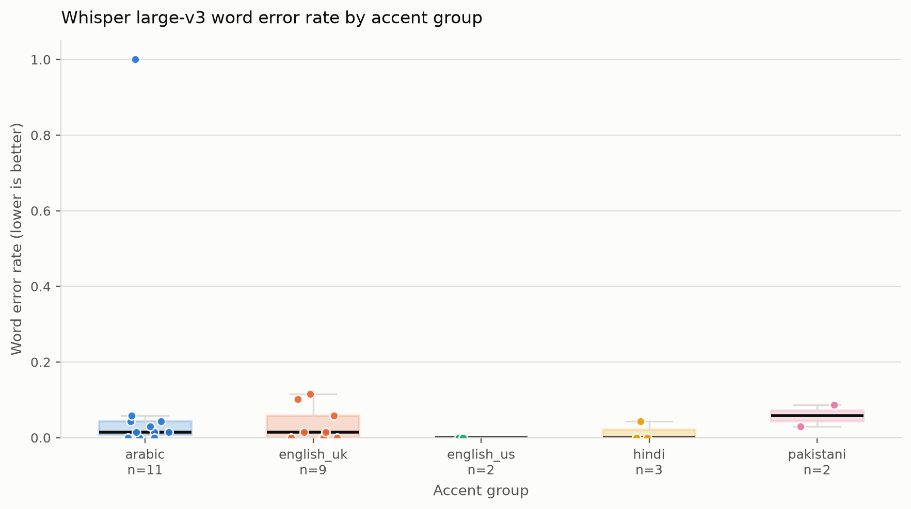

# Accent bias in Whisper speech recognition on English read speech

A small, reproducible study of whether OpenAI's `whisper-large-v3` transcribes
the **same English paragraph** less accurately when the speaker has a Pakistani
accent than when the speaker has one of several comparison accents.

Every speaker in the Speech Accent Archive reads one fixed elicitation
paragraph, so the reference text is constant across all clips. That removes
content as a confound: any difference in word error rate (WER) between accent
groups is a difference in how the model handles the speech signal, not a
difference in what was said.

Transcription has two interchangeable backends, and the analysis is identical
either way:

- **`hf_api`** (default) — the **Hugging Face Inference API**. No model
  download, no GPU, but it is metered and a free account's credits will not
  cover a full sample.
- **`local`** — the same `whisper-large-v3` run through `transformers`, for a
  free Colab or Kaggle GPU. No token, no credits. See
  [Free GPU run](#free-gpu-run-colab--kaggle).

Every transcript is cached, so reruns of the analysis cost nothing. Transcripts
from the two backends are **not** comparable and must be kept in separate
caches — see the warning in that section.

---

## Results

> **Status: transcription incomplete — 27 of 129 clips.** The run of
> 2026-09-20 stopped when the inference account's monthly credits were
> exhausted (HTTP 402). **No finding is reported below, and none should be read
> into the tables in `results/`.** See [`results/README.md`](results/README.md).

What the pipeline has verified so far, on the clips that did transcribe:

| accent | clips transcribed | of selected | mean WER | 95% CI |
|---|---|---|---|---|
| arabic | 11 | 30 | 0.111 | 0.013 – 0.295 |
| english_uk | 9 | 30 | 0.034 | 0.008 – 0.064 |
| hindi | 3 | 18 | 0.014 | 0.000 – 0.043 |
| english_us | 2 | 30 | 0.000 | 0.000 – 0.000 |
| **pakistani** (focus) | **2** | 21 | 0.058 | 0.029 – 0.087 |

**Why no comparison is reported.** With two clips in the focus group, the
pairwise tests are uninformative by construction: every Holm-corrected p-value
sits between 0.88 and 0.95, and the Cliff's delta of 1.00 against `english_us`
is forced by comparing two observations with two, not evidence of an effect.
The partial ordering also happens to put the Pakistani mean *below* the Arabic
mean, which is an artifact of which clips were reached before the credits ran
out, not a result.

**One real observation does survive**, because it does not depend on sample
size: Whisper returned **1 of 27 clips in Arabic script** — a translation of
the paragraph rather than a transcription of it. That failure mode is detected
and reported separately from word errors throughout the pipeline.



*Per-clip WER by accent from the partial run. Group sizes are printed under
each box — read them before reading the boxes.*

This section will carry the per-accent WERs, the Pakistani-vs-others
comparison with effect sizes, and the wrong-language counts once a complete run
exists. Regenerating it costs nothing beyond the missing clips, because every
transcript already paid for is cached.

---

## What the pipeline does

| Stage | Module | Output |
|---|---|---|
| Select clips into accent groups | `src/prepare_data.py` | `audio/<accent>/*.mp3`, `audio/manifest.csv` |
| Transcribe (`hf_api` or `local` backend) | `src/transcribe.py` | `results/transcripts*.jsonl` (cache) |
| Normalise text | `src/normalise.py` | — |
| Per-clip WER and error counts | `src/metrics.py` | `results/results.csv` |
| Group statistics and tests | `src/analysis.py` | `summary_by_accent.csv`, `pairwise_tests.csv`, `hard_words.csv`, … |
| Figures | `src/plots.py` | `results/figures/*.png` |

The headline metric is reported **twice**: over all clips, and over clips
excluding those Whisper returned in a non-Latin script (Urdu, Arabic,
Devanagari). Those "wrong language output" clips score a WER near 1.0 for a
qualitatively different reason than mis-heard words, so they are counted and
reported separately rather than silently averaged in.

---

## Setup (Windows)

Python 3.10 or newer is required.

```bat
:: from the repository root
python -m venv .venv
.venv\Scripts\activate
pip install -r requirements.txt
```

### Hugging Face token

Create a token with *read* access at <https://huggingface.co/settings/tokens>.

**Preferred: a `.env` file** in the repository root. Copy the template and fill
in your token:

```bat
copy .env.example .env
notepad .env
```

```ini
HF_TOKEN=hf_your_token_here
```

`.env` is in `.gitignore` and is never committed. It is read only at the point
the API client is built, and the token is never written anywhere else.

**Alternative: an environment variable.** If you would rather not keep the
token in a file:

```bat
setx HF_TOKEN "hf_your_token_here"
```

`setx` only affects **future** shells — close the terminal and open a new one,
then confirm with `echo %HF_TOKEN%`.

If both are present the **exported environment variable wins**, so a value set
in your shell always overrides the file. Either way the code resolves the token
through `os.environ`; it is never hard-coded.

> **If a token is ever exposed** — pasted into a chat, committed, shared in a
> log — revoke it at <https://huggingface.co/settings/tokens> and put the
> replacement in `.env`. Rotating costs nothing; a leaked token bills to your
> account.

---

## Getting the data

The audio is **not** included in this repository: the Speech Accent Archive is
distributed under its own terms and the recordings are the dataset authors' to
distribute, not this project's. Download it yourself.

1. Sign in to Kaggle and open
   <https://www.kaggle.com/datasets/rtatman/speech-accent-archive>.
2. Download the archive and unzip it into `raw_data/` in the repository root.
3. Check what you actually got — the Kaggle mirror has changed its folder
   nesting over time:

```bat
dir raw_data
dir raw_data\recordings
```

You need two things: the metadata CSV (`speakers_all.csv`) and the folder that
actually contains the `.mp3` files. On the current mirror that folder is
`raw_data\recordings\recordings`; on others it is `raw_data\recordings`. Pass
whichever one holds the mp3s as `--audio_src`. The recordings folder is searched
recursively, so pointing one level too high still works.

### Expected layout

```
Accent-bias-in-speech-recognition/
├── raw_data/                  # you provide this (git-ignored)
│   ├── speakers_all.csv
│   └── recordings/
│       └── recordings/
│           ├── afrikaans1.mp3
│           └── ...
├── audio/                     # built by prepare_data (git-ignored)
│   ├── manifest.csv
│   ├── pakistani/
│   ├── hindi/
│   ├── arabic/
│   ├── english_us/
│   └── english_uk/
├── results/                   # built by run
│   ├── README.md              # notes on the run that produced these tables
│   ├── transcripts.jsonl      # hf_api cache (git-ignored)
│   ├── transcripts_local.jsonl # local-backend cache (git-ignored)
│   ├── run_provenance.csv     # which backend produced the analysed rows
│   ├── results.csv
│   ├── summary_by_accent.csv
│   ├── pairwise_tests.csv
│   ├── error_types_by_accent.csv
│   ├── word_error_rates.csv
│   ├── hard_words.csv
│   ├── wrong_language_counts.csv
│   ├── overall_summary.csv
│   └── figures/*.png
├── colab/
│   └── run_on_colab.ipynb     # free GPU run
├── src/
├── tests/
├── .env                       # your token (git-ignored)
├── .env.example               # template, safe to commit
├── reference.txt
└── REPORT_TEMPLATE.md
```

---

## Running it

### Step 0 — build the accent sample

```bat
python -m src.prepare_data ^
  --csv raw_data\speakers_all.csv ^
  --audio_src raw_data\recordings\recordings ^
  --out audio ^
  --rule "pakistani:country=pakistan" ^
  --rule "hindi:native_language=hindi" ^
  --rule "arabic:native_language=arabic" ^
  --rule "english_us:country=usa&native_language=english" ^
  --rule "english_uk:country=uk&native_language=english" ^
  --max_per_group 30
```

The script logs the CSV's real column names, how many metadata rows each rule
matched, and how many files each accent ended up with. A group with fewer than
10 clips is kept but **warned about** — read the warning, because a group that
small makes its confidence interval and p-values indicative at best.

A `--rule` is `name:field=value` with `&` for additional conditions. Field names
are matched case-insensitively against the CSV header (`native_language`,
`Native Language` and `nativelanguage` all work), and a rule that names a column
the CSV does not have fails with the list of columns it does have. Each speaker
lands in the **first** rule they match, so the groups are disjoint.

### Step 1 — a cheap test run first

Transcribe a handful of clips only, to confirm the token and the API work
before spending credits on the whole sample:

```bat
python -m src.run --audio_dir audio --out results --limit 5
```

Clips are queued **round-robin across accents**, not accent by accent, so a
small `--limit` samples every group rather than only the alphabetically first
one.

### Step 2 — the full run

```bat
python -m src.run --audio_dir audio --out results
```

Clips already in `results/transcripts.jsonl` are skipped, so this picks up where
the test run stopped. Reruns after a code change cost nothing if the cache is
intact; to re-analyse without any possibility of an API call, add
`--skip_transcribe`.

### If the run stops early

Inference is metered. When an account's included credits run out, the API
returns `402 Payment Required` and no further call can succeed, so the run
**aborts immediately** rather than repeating the same error for every remaining
clip. A rejected token (`401`) or an unknown model id (`404`) behaves the same
way. Transient problems — rate limits, `503`, timeouts — are retried with
exponential backoff instead.

Every clip transcribed before the stop is already cached, and a failed clip is
never cached, so rerunning the same command resumes and pays only for what is
missing:

```bat
python -m src.run --audio_dir audio --out results
```

Because of the round-robin ordering, a truncated run leaves a roughly balanced
sample across accents, and a resumed run favours the groups furthest behind.
That matters: an accent-order queue that runs out of credit produces a complete
first group and almost nothing for the last, which cannot support any
comparison. Check the per-accent counts in `summary_by_accent.csv` before
reading anything into the results, and record the state of the run in
`results/README.md`.

### Free GPU run (Colab / Kaggle)

The hosted API is metered, and a free account's credits do not cover 129 clips.
The `local` backend runs the same model on a free Colab or Kaggle GPU instead,
with **no token and no credits**.

Open [`colab/run_on_colab.ipynb`](colab/run_on_colab.ipynb) in Colab (Runtime →
Change runtime type → **GPU**). It checks the GPU, installs `torch`,
`transformers` and `accelerate`, takes an `audio.zip` you upload, runs:

```bash
python -m src.run --audio_dir audio --out results \
    --backend local --transcripts results/transcripts_local.jsonl
```

and zips the transcripts for download. Back on your laptop, re-derive every
table and figure with no GPU and no API:

```bat
python -m src.run --audio_dir audio --out results ^
  --transcripts results/transcripts_local.jsonl --skip_transcribe
```

The two backends differ only in where inference happens. Both load
`whisper-large-v3`, neither forces a language — Whisper auto-detects, so a clip
transcribed into the speaker's first language is still visible as the
wrong-language failure this study measures. The local backend loads the model
once and reuses it, uses float16 on CUDA and float32 on CPU, and processes
audio in 30-second chunks. `torch` and `transformers` are imported lazily, so a
machine with neither installed can still use `hf_api` and run the tests.

> ### ⚠️ Never mix backends in one analysis
>
> A hosted provider's build of Whisper and a local one can differ in version,
> precision and decoding. Pooling their transcripts would put those differences
> into the WER, where they are **indistinguishable from an accent effect** —
> the exact thing this study is trying to measure.
>
> Give each backend its own cache via `--transcripts`, and analyse them
> separately. The pipeline defends this itself: every cached row records its
> `backend`, a run warns when a cache already holds another backend's
> transcripts, the analysis warns again if the records it scores are mixed, and
> `results/run_provenance.csv` reports the breakdown for whatever was analysed.
>
> Comparing the two backends against each other is a legitimate experiment —
> just not the same experiment as comparing accents. Run it as its own
> analysis, over the same clips, and report it separately.

### Tests

```bat
python -m pytest -q
```

The suite mocks the Inference API, so it needs no token and no network.

---

## Reproducibility notes

- **One seed** (`SEED = 12345` in `src/config.py`) drives the per-group
  subsample, the 10,000-resample bootstrap, and the jitter in the boxplot.
  Re-running `prepare_data` with the same CSV, the same rules and the same seed
  selects the same clips.
- **The transcript cache is the unit of reproducibility.** `transcripts.jsonl`
  records the model id and a UTC timestamp per clip. A hosted model can change
  behind a stable name, so the cache — not the model name alone — is what makes
  a specific set of numbers reproducible. Keep it if you want to re-derive the
  exact tables later. It is git-ignored because it contains full transcripts of
  the dataset's audio.
- **Clip order is deterministic.** The round-robin queue depends only on the
  sorted accent names and sorted filenames, so the same audio folder always
  produces the same order and the cache stays stable across runs.
- **Normalisation is applied to both sides** (reference and hypothesis) with the
  same function, so the comparison is symmetric.
- Statistical choices are fixed in advance: two-sided Mann-Whitney U per pair,
  Holm correction across the family of comparisons against the Pakistani group,
  Cliff's delta as effect size, percentile bootstrap for the group means.
- The analysis re-runs deterministically from a fixed `results.csv`; only the
  transcription step depends on an external service.

---

## Limitations

Read carefully before generalising anything from this study.

- **Read speech only.** Every clip is a scripted paragraph read aloud.
  Conversational and spontaneous speech is harder in ways this design cannot see.
- **One passage.** The same 69-word paragraph throughout. Useful as a control,
  but it means the vocabulary is tiny and fixed; word-level findings are about
  *these* words, not English generally.
- **Small samples.** Tens of clips per accent at most. Rank tests and bootstrap
  intervals are used precisely because the samples are small, but small samples
  still mean wide intervals and limited power.
- **A single model, at one point in time.** `whisper-large-v3` via a hosted API.
  Results may not transfer to other models, other sizes, or to the same model
  later.
- **Accent groups are proxies.** A group is defined by country of birth or
  self-reported native language in the metadata, not by any phonetic assessment.
  "Pakistani" is a passport-and-L1 label covering Urdu, Punjabi, Pashto, Sindhi
  and other first languages, and speakers within any group vary widely in age of
  English onset and exposure. Treat group labels as coarse strata, not as
  descriptions of how anyone speaks.
- **Speaker-level confounds are not controlled.** Age, sex, age of English
  onset and recording conditions differ across groups and are not modelled;
  `audio/manifest.csv` carries the metadata needed to check them if you want to.
- **WER is not the only thing that matters.** A transcript can be low-WER and
  still unusable, or high-WER and still understandable. Measured error is a
  proxy for harm, not harm itself.
- **Clips are not independent of the archive's own sampling.** The Speech Accent
  Archive was not built as a representative sample of any population.

---

## Ethics note

This repository studies a deployed model's error rates across speaker groups.
The accent labels come from the dataset's metadata and describe *recordings*,
not the worth or intelligibility of any speaker. Findings of higher error rates
are statements about the model, not about the speakers. The audio is excluded
from the repository in line with the dataset's terms.

---

## Citation

The dataset:

> Weinberger, S. (2013). *Speech accent archive*. George Mason University.
> <http://accent.gmu.edu>

Kaggle mirror: `rtatman/speech-accent-archive`.

If you use this code, please also cite the Whisper model you queried.

---

## License

MIT — see [LICENSE](LICENSE). The licence covers this code only, not the dataset.
